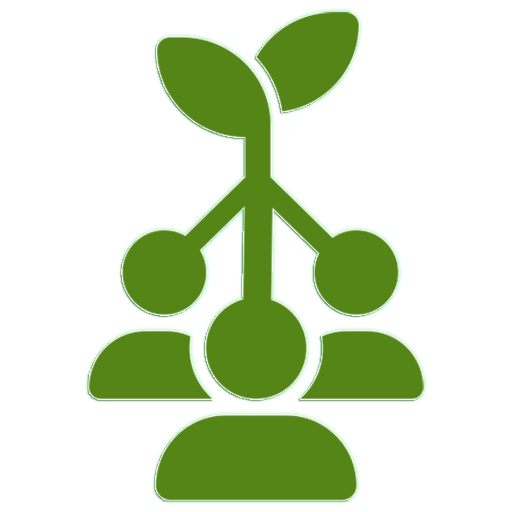
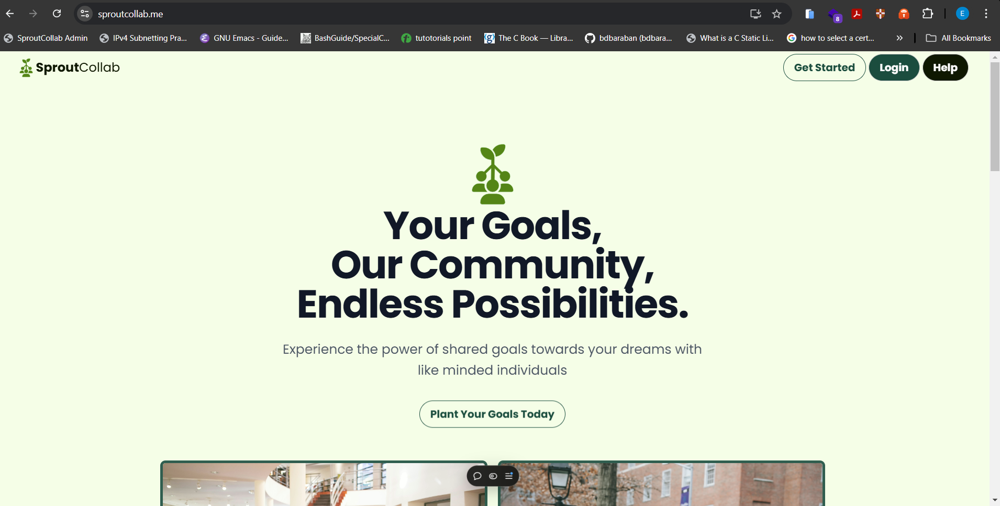
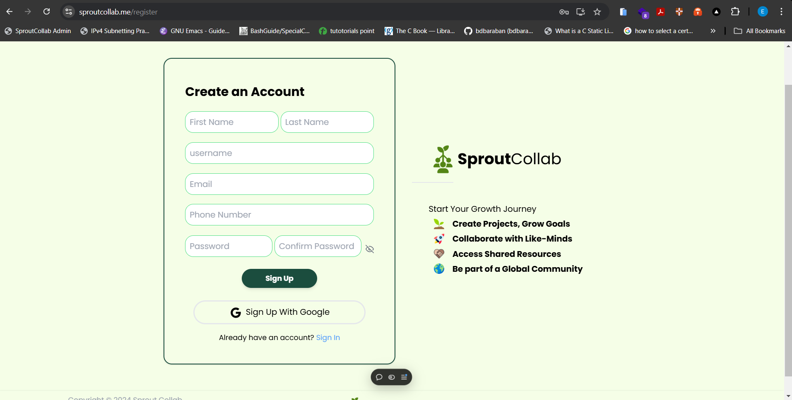
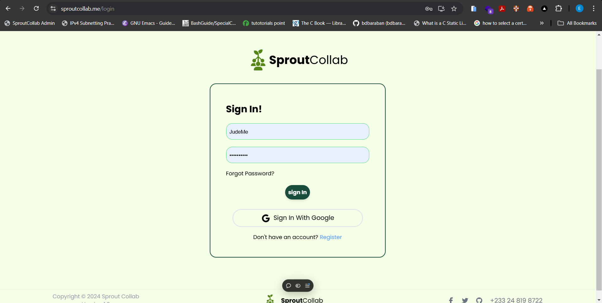
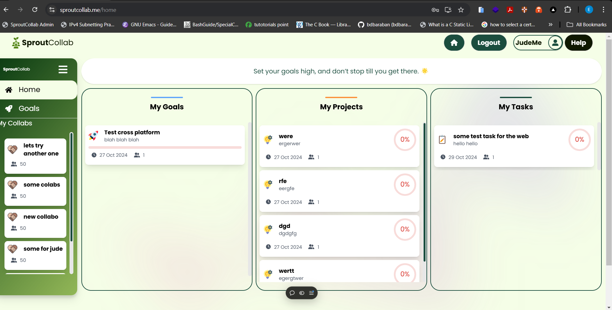
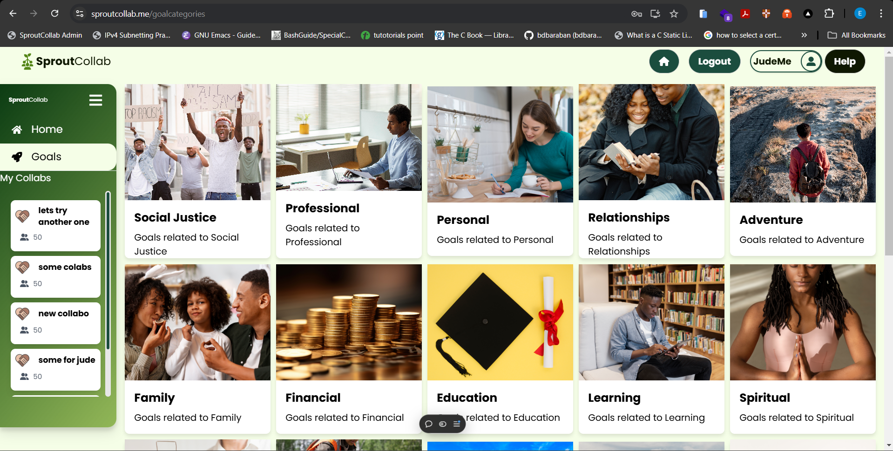
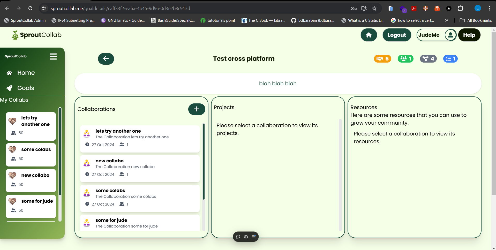
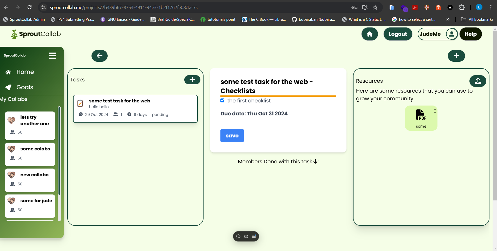
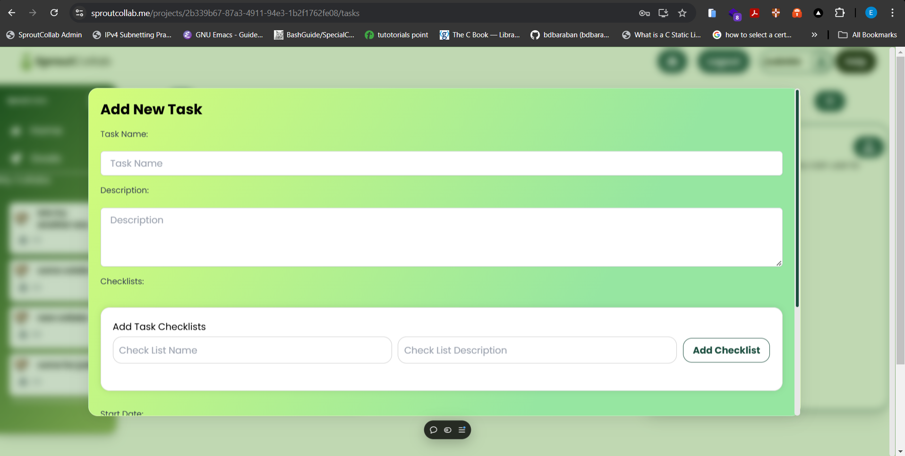

# SproutCollab

<p align="center">
  
</p>

[](https://sproutcollab.me)
[](https://opensource.org/licenses/MIT)
[](https://reactjs.org/)
[](https://flask.palletsprojects.com/)

A platform for collaborative goal-setting and task management.

## Overview

SproutCollab is a collaborative platform that helps users set and manage goals, track tasks, and work together effectively. With integrated file storage and sharing capabilities through Firebase, the platform enhances productivity and streamlines teamwork for individuals, freelancers, and teams.

### Key Features

- **Goal Setting Made Simple**: Easy creation and management of personal or group goals
- **Visual Collaboration Tools**: Intuitive interface for team collaboration
- **Effective Task Management**: Streamlined task tracking and organization
- **File Storage Integration**: Seamless file sharing using Firebase
- **Iterative Workflow Improvements**: Continuous platform enhancement
- **Core Collaboration Features**: Tools designed for team productivity

## 🚀 Quick Start

```bash
# Clone the repository
git clone https://github.com/yourusername/sproutcollab.git

# Navigate to the project directory
cd sproutcollab

# Install dependencies
npm install

# Start the development server
npm start
```

## Problem & Solution

**Problem**: Many collaboration platforms lack an integrated system for goal-setting alongside task management, making it difficult to align daily tasks with long-term objectives.

**Solution**: SproutCollab combines goal-setting and task management within a single platform, allowing users to easily set, track, and manage both personal and group goals while working collaboratively.

## Screenshots

### User Interface

<p align="center">
  Landing Page
</p>
<p align="center">
  
</p>

<p align="center">
  Register Page
</p>
<p align="center">
  
</p>

<p align="center">
  Login Page
</p>
<p align="center">
  
</p>

<p align="center">
  Homepage
</p>
<p align="center">
  
</p>

### Features

<p align="center">
  Goal Categories
</p>
<p align="center">
  
</p>

<p align="center">
  Goal Detail Page
</p>
<p align="center">
  
</p>

<p align="center">
  Tasks Page
</p>
<p align="center">
  
</p>

<p align="center">
  Add Task
</p>
<p align="center">
  
</p>

## Technologies Used

### Frontend Stack

- [React](https://reactjs.org/)
- [CSS/Styled Components](https://styled-components.com/)

### Backend Stack

- [Python/Flask](https://flask.palletsprojects.com/)
- [MySQL](https://www.mysql.com/)
- [Redis](https://redis.io/) (for caching)

### Cloud Services

- [Firebase](https://firebase.google.com/) (file storage)
- [Digital Ocean](https://www.digitalocean.com/) (backend hosting)
- [Vercel](https://vercel.com/) (frontend hosting)

### Development Tools

- Git
- Docker

## Third-Party Services

- Firebase Storage
- Google OAuth/Custom Authentication

## API Routes

The following routes support POST, GET, PUT, and DELETE methods:

```bash
/api/users
/api/goals
/api/collaborations
/api/tasks
```

## Product Features

- **Price**: Free to use
- **Availability**: MVP is publicly available
- **Target Users**: Individuals and teams requiring collaborative workspace for project management
- **Future Updates**: Full chat system integration planned

## Development Timeline

1. **Week 1**: Project setup, React component design, and initial layout
2. **Week 2**: Integration with Flask API and Firebase setup
3. **Week 3**: Implementing chat functionality and task management
4. **Week 4**: Final testing, debugging, and deployment

## Learning Goals Achieved

- Frontend Development with React
- Backend Integration with Python/Flask
- Firebase Integration for file storage
- Real-Time Communication implementation (planned for future updates)

## Competitive Advantages

### vs Trello

- Advanced goal-setting capabilities
- Integrated file storage through Firebase
- Focus on collaborative goal tracking

### vs Monday.com

- Streamlined, task-focused environment
- Simpler out-of-the-box solution
- Specific focus on collaboration and goal tracking

## Contact Information

- 👨‍💻 **Developer**: Ellis Armah Ayikwei (CEO & Founder)
- 📧 **Email**: [ellisarmahayikwei@gmail.com](mailto:ellisarmahayikwei@gmail.com)
- 📱 **Phone**: [+233248138722](tel:+233248138722)
- 🌐 **Website**: [sproutcollab.me](https://sproutcollab.me)
- 🐦 **Twitter**: [@SproutCollab](https://twitter.com/SproutCollab)

## 🔗 Additional Links

- [API Documentation](https://api.sproutcollab.me/docs)

## Project Status

The MVP is currently available to the public, with ongoing development focused on enhancing features and implementing a full chat system in future updates.

---

_Your goals, Our Community_

<p align="center">Made with ❤️ by Ellis Armah Ayikwei</p>

[⬆ Back to Top](#sproutcollab)
